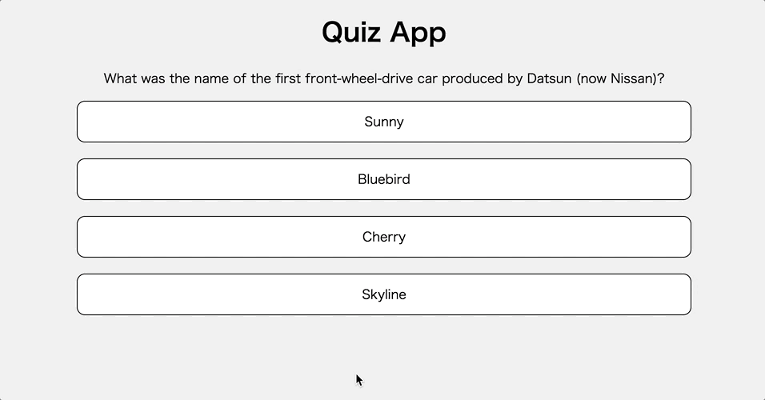

# レポジトリ内容

このレポジトリは[Web白熱教室](https://tsuyopon.xyz/)の[JavaScriptの学習コンテンツ > JavaScriptフロントエンド編](https://tsuyopon.xyz/learning-contents/web-dev/javascript/frontend/)にある「[【エクササイズ】async/awaitを使ってクイズアプリを作る](https://tsuyopon.xyz/learning-contents/web-dev/javascript/frontend/js-excercise-for-frontend-9/)」で利用するものです。

### 完成形(表示内容はリロードする度に変わる)

## 課題

以下の「課題をクリアするためのステップ」の内容を全て対応して、`index.html`をブラウザで開き、上の完成形の画像と同じような機能を実装する。(API(ネットワーク)経由でのデータの取得が完了されるまではクイズデータの表示はされないことに注意する。)

基本的には「[【エクササイズ】Fetch APIを使ってクイズアプリを作る](https://tsuyopon.xyz/learning-contents/web-dev/javascript/frontend/js-excercise-for-frontend-8/)」と同じアプリの実装になる。

異なる点は「async/await」を使った実装になったところ。そのため、レビュー時は「async/await」を正しく使えているかがポイントとなる。

### 課題をクリアするためのステップ

1. [ ] main.jsの中のコメントに記述されている課題をクリアしてください。

## 答え

- 答えは `answer.html`, `answer.js`, `answer.css` の中身になります。参考記事を読んでもわからなくなった場合は、答えの実装を見て、コードの流れを理解してからまたチャレンジしてみてください。(コピペ厳禁)
  - `answer.html`, `answer.js`, `answer.css` はあくまでも解答の一例のため、参考する実装例の1つとして認識する。

## 参考記事

課題をこなしていて、行き詰まったら以下の資料を参考にしていただければ解答にたどり着けるかと思います。

- Web白熱教室
  - [JavaScriptのasyncとawaitの概要【Promiseの発展系】](https://tsuyopon.xyz/learning-contents/web-dev/javascript/frontend/overview-of-async-and-await-in-js/)
  - [【JavaScript】asyncとawaitの使い方【サンプルコード付き】](https://tsuyopon.xyz/learning-contents/web-dev/javascript/frontend/how-to-use-async-and-await-in-js/)
  - [【JavaScript】async/awaitでの例外処理の方法](https://tsuyopon.xyz/learning-contents/web-dev/javascript/frontend/how-to-handle-exception-in-async-await/)